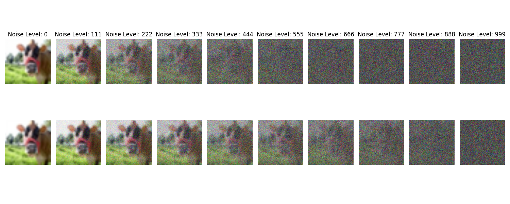

# Denoising Diffusion Probabilistic Models

Modern state of the art generative models have been largely diffusion models and GANs. In this repo, we build a diffusion model from the [original paper](https://arxiv.org/abs/2006.11239) and [the following paper by openAI](https://arxiv.org/abs/2102.09672). 

We try both the linear schedule and the cosine schedule proposed in the papers. Here's an example:

